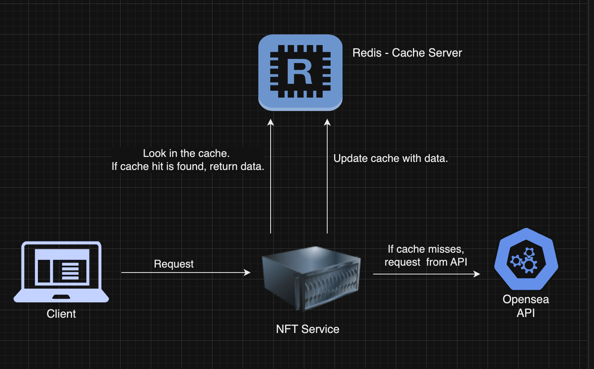

# Balthazar NFT Viewer - Frontend

## Overview

Balthazar NFT Viewer is a web application that allows users to view NFT data for a given Ethereum wallet address and collection. This repository contains the frontend built with Next.js and Tailwind CSS. The frontend interacts with the backend service to fetch and display NFT data in a user-friendly manner.



## Technologies and APIs

### Frontend

- **Next.js**: A React framework for server-rendered applications and static website generation.
- **Tailwind CSS**: A utility-first CSS framework for rapid UI development.

### APIs

- **Balthazar Backend API**: Provides endpoints to fetch NFT data from the OpenSea API and uses Redis for caching.

## Instructions to Set Up and Run the Project

### Prerequisites

- Node.js (>= 14.x)
- npm (>= 6.x)

### Installation

1. **Clone the Repository**

   ```bash
   git clone https://github.com/nuwanrg/balthazar-frontend.git
   cd balthazar-frontend
   ```

2. **Install Dependencies**

   ```bash
   npm install
   ```

3. **Set Up Environment Variables**

   Create a `.env` file in the `balthazar-frontend` directory with the following content:

   ```plaintext
   NFT_DATA_URL=http://localhost:3001/nft/dataWithCache
   ```

4. **Build & Run the Frontend**

   ```bash
   npm run build
   ```

   ```bash
   npm run dev
   ```

   The frontend will be available at `http://localhost:3000`.

## Challenges Faced and How They Were Overcome

### CORS Issues

- **Challenge**: When integrating the frontend with the backend, CORS issues were encountered.
- **Solution**: Configured the backend to include CORS headers to allow requests from the frontend origin.

### Environment Configuration

- **Challenge**: Managing different configurations for local development and production.
- **Solution**: Utilized `.env` files and the `next.config.js` for environment-specific settings, ensuring smooth transitions between environments.

### Dynamic Data Fetching

- **Challenge**: Ensuring that the data grid updates dynamically based on user input without requiring page reloads.
- **Solution**: Implemented event handlers and state management to fetch and display data dynamically when the collection dropdown changes.

## Assumptions Made During Development

- **API Endpoint Availability**: It is assumed that the backend service is running and accessible at `http://localhost:3001//nft/dataWithCache`.
- **Valid Ethereum Wallet Address**: The frontend includes basic validation for Ethereum wallet addresses, assuming valid inputs from users.

## Conclusion

The Balthazar NFT Viewer frontend is a modern web application that leverages Next.js and Tailwind CSS to provide a responsive and interactive user interface for viewing NFTs. It seamlessly integrates with the backend service to fetch and display NFT data.

Feel free to contribute or raise issues if you encounter any problems!

## License

This project is licensed under the MIT License. See the [LICENSE](LICENSE) file for details.
